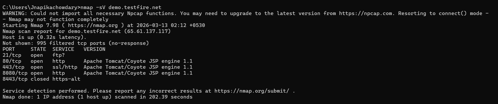
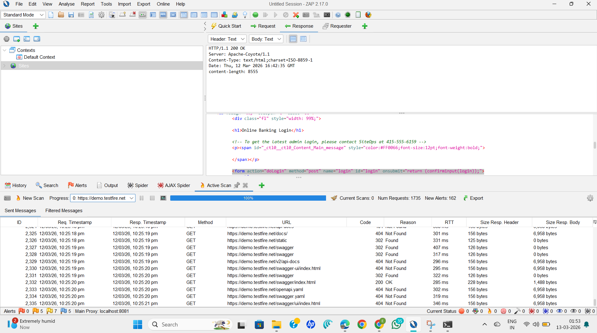
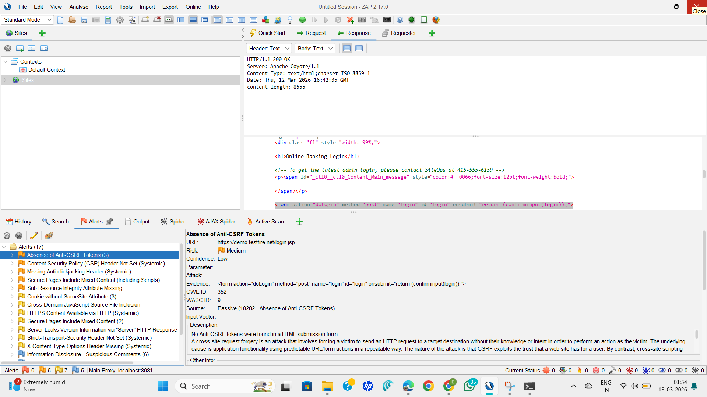

# Task 1 – Vulnerability Assessment using Nmap and OWASP ZAP

## Objective
The objective of this task is to perform a vulnerability assessment on a target web application. The goal is to identify open ports, running services, and potential security vulnerabilities using security scanning tools.

---

## Tools Used
- Nmap
- OWASP ZAP

---

## Target
https://demo.testfire.net

---

# Nmap Scan Results

## Command Used
```
nmap -sV demo.testfire.net
```

## Results

The scan detected the following open ports and services:

| Port | State | Service | Version |
|-----|------|------|------|
| 80 | Open | HTTP | Apache Tomcat/Coyote JSP Engine |
| 443 | Open | HTTPS | Apache Tomcat/Coyote JSP Engine |
| 8080 | Open | HTTP | Apache Tomcat/Coyote JSP Engine |
| 8443 | Closed | HTTPS-alt | - |

## Analysis

The scan identified multiple open ports running web services. Port **80** and **443** are standard HTTP and HTTPS ports used for web applications.  

Port **8080** is commonly used for alternative web services or application servers such as **Apache Tomcat**.

The detected service **Apache Tomcat/Coyote JSP Engine** indicates that the web application is running on a Tomcat server environment. These services were further analyzed using OWASP ZAP to detect potential vulnerabilities in the web application.

---

# OWASP ZAP Vulnerability Scan Results

The automated vulnerability scan detected several potential security issues in the web application.

---

## Vulnerability 1 – Cross-Site Scripting (Reflected)

**Risk Level:** High

### Description
Reflected Cross-Site Scripting (XSS) occurs when user input is included in the server response without proper validation or encoding. Attackers can inject malicious scripts which execute in the victim's browser.

### Impact
- Session cookie theft
- Redirecting users to malicious websites
- Executing unauthorized actions

### Recommendation
- Validate and sanitize user input
- Use output encoding
- Implement Content Security Policy (CSP)

---

## Vulnerability 2 – SQL Injection

**Risk Level:** High

### Description
SQL Injection occurs when user input is directly included in database queries without proper validation. Attackers can manipulate SQL queries to access or modify sensitive information stored in the database.

### Impact
- Unauthorized data access
- Database modification
- Data leakage

### Recommendation
- Use prepared statements
- Implement parameterized queries
- Validate all user inputs

---

## Vulnerability 3 – Absence of Anti-CSRF Tokens

**Risk Level:** Medium

### Description
The application does not include Anti-CSRF tokens in HTML form submissions. Cross-Site Request Forgery (CSRF) attacks allow attackers to trick authenticated users into performing unintended actions.

### Impact
Attackers could perform actions on behalf of the victim using their active session.

### Recommendation
- Generate unique CSRF tokens for each request
- Validate CSRF tokens on the server side
- Avoid using GET requests for sensitive operations

---

## Vulnerability 4 – Cookie without SameSite Attribute

**Risk Level:** Low

### Description
Cookies were configured without the SameSite attribute, which allows them to be sent with cross-site requests.

### Impact
This may increase the risk of Cross-Site Request Forgery attacks.

### Recommendation

Set the SameSite attribute in cookies.

Example:

```
Set-Cookie: sessionid=value; SameSite=Strict
```

---

## Vulnerability 5 – Missing Anti-Clickjacking Header

**Risk Level:** Medium

### Description
The application does not include the **X-Frame-Options** security header. This allows attackers to embed the webpage inside a malicious iframe.

### Impact
Users may unknowingly interact with hidden elements controlled by attackers.

### Recommendation

Add the following security header:

```
X-Frame-Options: DENY
```

or

```
X-Frame-Options: SAMEORIGIN
```

---

# Scan Evidence (Screenshots)

The following screenshots provide proof of the vulnerability assessment performed using Nmap and OWASP ZAP.

## Nmap Scan Output

The screenshot below shows the Nmap scan results identifying open ports and services on the target system.



---

## OWASP ZAP Scan Results

The screenshots below show the automated vulnerability scan results performed using OWASP ZAP.





---

# Learning Outcome

Through this task, I gained practical experience in performing vulnerability assessments using tools such as **Nmap** and **OWASP ZAP**.  

I learned how to:
- Perform network scanning
- Identify open ports and services
- Detect common web application vulnerabilities
- Understand the importance of secure coding practices

This task helped strengthen my understanding of cybersecurity testing and vulnerability analysis.

---

# Conclusion

The vulnerability assessment successfully identified open ports and several security vulnerabilities in the target web application.  

Common issues such as **Cross-Site Scripting, SQL Injection, missing security headers, and CSRF weaknesses** were identified during the scan.  

Regular vulnerability assessments and proper implementation of security controls can significantly reduce the risk of cyber attacks and help organizations protect sensitive data.

---

## Ethical Considerations

This vulnerability assessment was conducted for educational purposes as part of the Future Interns Cyber Security Internship Task-1.

The target website (demo.testfire.net) is a deliberately vulnerable web application designed for security testing and training. No unauthorized systems were targeted during this assessment.

All testing activities were performed responsibly and ethically, following cybersecurity best practices.
